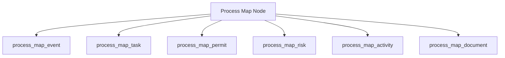

# 🏗️ SHEEner System Architecture

**Version:** 1.0  
**Last Updated:** April 2026  
**Status:** Unified Architectural Blueprint

---

## 🌟 System Overview

SHEEner is a comprehensive Pharmaceutical EHS (Environment, Health, and Safety) and Operations Management System. It is designed to bridge the gap between high-level process mapping and operational execution, ensuring compliance and efficiency across the organization.

### 🧩 Core Architecture Pillars

1.  **Hierarchical Process Mapping**: The backbone of the system, linking strategy to specific tasks.
2.  **PWA Core**: A modern, offline-first mobile experience for on-the-ground reporting.
3.  **Secure RBAC**: A robust permissions model supporting multiple-role access.
4.  **Integrated Governance**: Change control, risk assessments, and audit trails baked into every action.

---

## 📱 External Access Layer (PWA & Connectivity)

The system utilizes a Progressive Web App (PWA) architecture to provide native-like performance on mobile devices without the overhead of app stores.

| Component | Technology | Role |
| :--- | :--- | :--- |
| **Backend Core** | PHP 8.1+ | High-performance, strictly-typed logic layer. |
| **PWA Core** | Service Workers + Manifest | Enables offline reporting and background synchronization. |
| **Offline Storage** | IndexedDB | Stores reports locally when the network is unavailable. |
| **Secure Tunnel** | Cloudflare Tunnel / ngrok | Bridges internal servers to external mobile devices securely. |
| **Quick Access** | QR Code System | Allows instant form access via facility QR scans. |

**Key Documents:**
- [PWA Deployment Guide](file:///d:/xampp/htdocs/sheener/md/README.md)
- [External Access Implementation](file:///d:/xampp/htdocs/sheener/md/PWA_IMPLEMENTATION.md)

---

## ⚙️ Application Logic Layer (Modules)

The system is modularized into specialized centers, all accessible through a unified dashboard.

### 📋 Operational Modules
*   **Event Center**: Incident and accident reporting with GPS auto-capture.
*   **Permit Center (PTW)**: Management of Permit-to-Work with visual status indicators.
*   **Task Center**: Assignment-based workflow for operational steps.
*   **Change Control (CC)**: Major/Minor change request tracking and justification.
*   **Assessment Center**: HIRA (Hazard Identification and Risk Assessment).

### 🏷️ 6Ps Registry (Master Data)
- **People**: Employee registry linked to roles.
- **Products**: Materials and inventory management.
- **Places**: Facility areas and locations.
- **Plants**: Equipment and machinery tracking.
- **Processes**: Master document and SOP repository.
- **Power**: Energy management registry.

**Key Technical Map:**
- [AI Page & Endpoint Map](file:///d:/xampp/htdocs/sheener/ai-agent-config.json)

---

## 🔒 Security & Governance (RBAC)

The system implements a standardized **Role-Based Access Control** structure.

-   **Multi-Role Support**: Users can hold multiple roles (e.g., Admin + Approver).
*   **Permission Granularity**: Access is controlled at the action level (view, edit, delete, review).
*   **Helper Pattern**: Standardized `rbac_helper.php` for consistent server-side validation.

**Authoritative Source:**
- [RBAC Structure Detail](file:///d:/xampp/htdocs/sheener/md/RBAC_STRUCTURE.md)

---

## 📊 Data Layer (Architecture)

The data architecture is centered around a hierarchical `process_map` that acts as a junction point for all operational records.

### 🧬 Hierarchical Junction Tables
Links between process nodes and operational records are managed via specialized junction tables to maintain data integrity and support CASCADE DELETE operations.

### 📒 Audit & Compliance
-   **Core Audit Table**: `auditlogs` tracks every data modification.
-   **Process Audit**: `process_map_audit` specific to structural changes in the process map.
-   **Data Architecture Summary**: [DATABASE_SCHEMA.md](file:///d:/xampp/htdocs/sheener/md/DATABASE_SCHEMA.md)
-   **Full Database Source**: [database_schema.json](file:///d:/xampp/htdocs/sheener/database_schema.json)

---

## 📂 Documentation Library Structure

To keep the technical picture clear, documentation is organized into categories:

### 🛠️ Technical Implementation
- [Gap Analysis & Implementation Plan](file:///d:/xampp/htdocs/sheener/md/PROJECT_VALIDATION_SUMMARY.md)
- [Recent Mobile Fixes Log](file:///d:/xampp/htdocs/sheener/md/MOBILE_FIXES.md)
- [Database Structure Reference](file:///d:/xampp/htdocs/sheener/database_schema.json)

### 📘 Setup & User Guides
- [System Admin Readiness Checklist](file:///d:/xampp/htdocs/sheener/md/DEPLOYMENT_CHECKLIST.md)
- [User Training Foundation](file:///d:/xampp/htdocs/sheener/md/user_training_guide.md)
- [PWA Quick Start Guide](file:///d:/xampp/htdocs/sheener/md/QUICK_START.md)

---

## 🚀 Next Steps & Evolution
- [ ] Integration of Analytics Dashboards.
- [ ] Automated Notification System.
- [ ] Webhook support for third-party integrations.

**Main Entry Point**: [DOCUMENTATION_INDEX.md](file:///d:/xampp/htdocs/sheener/md/DOCUMENTATION_INDEX.md)
